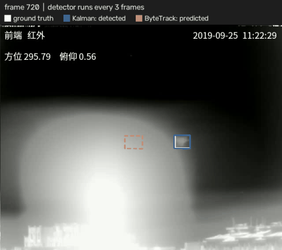
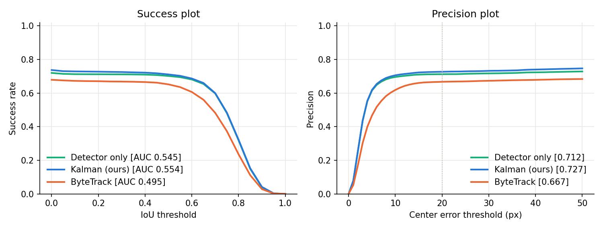
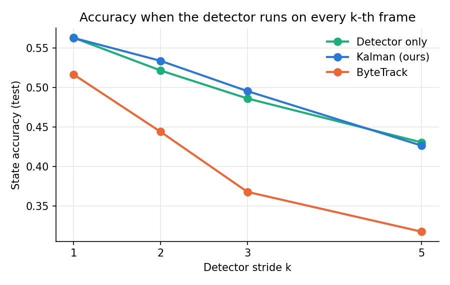

# Anti-UAV Drone Tracking: Kalman Filter vs ByteTrack

Single-drone tracking in infrared video (Anti-UAV dataset), built on a YOLOv8 detector. A hand-written Kalman Filter tracker and ByteTrack are compared against a no-tracking baseline. All three methods use the **same cached detections**, tuning is done **only on held-out validation recordings**, and results are reported on the **untouched test recordings** with the official Anti-UAV metric.

<p align="center">
  
  <br><em>Detector runs on every 3rd frame. White: ground truth, blue: Kalman (ours), orange: ByteTrack. Dashed = predicted without a detection. Illustrative clip, chosen to show the difference.</em>
</p>

## Key findings

1. **Tracking cannot beat the detector's recall.** On the test recordings the detector finds the drone in only **71%** of the visible frames, even at score ≥ 0.05 (98.5% on validation recordings). Every method is capped by that, and no tracker rescues sequences where the detector fails for long stretches (e.g. `1_6`, state accuracy 0.14-0.15 for all methods).
2. **With the detector on every frame, the Kalman tracker matches the baseline** (state accuracy 0.563 vs 0.563) with slightly better localization (Precision@20px 0.727 vs 0.712), at a cost of 0.04 ms/frame. ByteTrack is lower (0.516).
3. **When the detector skips frames to save compute, the Kalman tracker holds up best up to k = 3.** It stays ahead of "repeat the last box" at k = 2 and 3. The gap is larger on the validation recordings, where the detector is reliable: 0.714 vs 0.675 at k = 3. Those are tuning-set scores, so they are optimistic. ByteTrack drops sharply (0.516 → 0.368 at k = 3).
4. **Why ByteTrack degrades: IoU matching breaks for small, fast targets.** The drone box is ~41 px. Between two detector runs at k = 3 the drone moves 12 px (median) and 47 px (90th percentile), so the prediction and the new detection often do not overlap at all. ByteTrack then starts a new track instead of continuing the old one (100+ track IDs per sequence for a single drone). The Kalman tracker matches on center distance scaled by its own uncertainty (Mahalanobis gating), so it does not depend on overlap.
5. **BYTE's low-score second round barely matters here** (0.516 → 0.515 without it). The best thresholds are at the bottom of the searched range, so almost every detection is already "high score".

## Pipeline

```
infrared video ─► YOLOv8m detector ─► cached boxes (score ≥ 0.05) ─┬─► Detector only (no tracking)
                  (run once per video)                              ├─► Kalman tracker (ours)
                                                                    └─► ByteTrack (single target)
                                                                             │
                     val recordings: grid search of tracker parameters ◄─────┤
                     test recordings: final metrics with the tuned values ◄──┘
```

- **Data:** [Anti-UAV](https://anti-uav.github.io/) (2020), infrared stream, 640×512 at 20 fps. One drone per sequence, with per-frame `exist` flags (the drone can leave the view or be occluded).
- **Detector:** YOLOv8m trained with the [Anti-UAV-Drone-Detection](https://github.com/yavuzkrm/Anti-UAV-Drone-Detection) repo (`python train.py infrared`, 15 epochs, val mAP50 0.989). Two whole recordings are held out of detector training. They form the **val** split here: 13 sequences.
- **Test:** the dataset's 15 test sequences (14,348 frames), recorded separately. Never used for training or tuning.
- **Same input for everyone:** the detector runs once per video and its boxes are cached, so differences between methods come from tracking alone.

## Methods

| Method | Motion model | Association | Without a detection |
|---|---|---|---|
| **Detector only** | none | highest-scoring box | reports nothing (or repeats the last box if the detector was skipped) |
| **Kalman (ours)**, [`tracking/kalman_tracker.py`](tracking/kalman_tracker.py) | 6D constant acceleration on the box center | nearest detection inside a Mahalanobis gate | predicts for up to `max_missed` frames, then drops the track |
| **ByteTrack** ([ultralytics](https://github.com/ultralytics/ultralytics) implementation), [`tracking/bytetrack.py`](tracking/bytetrack.py) | 8D constant velocity on center, aspect ratio, height | Hungarian on IoU, two rounds (high, then low score) | lost tracks kept for re-matching. Reports the lost target's prediction for `coast` frames (added for a fair comparison) |

ByteTrack is a multi-object tracker. Here it reports one box per frame: the current target while it is tracked, otherwise the highest-scoring track.

## Metrics

| Metric | Definition |
|---|---|
| **State accuracy** (official Anti-UAV) | per frame: IoU with ground truth if the drone is visible. If it is absent: 1 for reporting no box, 0 otherwise. Mean over frames, then over sequences |
| **Success AUC** | area under the success plot (fraction of visible frames with IoU > t, t ∈ [0, 1]) |
| **Precision@20px** | fraction of visible frames with center error ≤ 20 px |
| **False alarm rate** | fraction of absent frames where a box was still reported (only 4 test sequences contain absent frames) |

## Results (test split)

| Method | State acc. ↑ | Success AUC ↑ | Precision@20px ↑ | False alarm ↓ | Tracker ms/frame |
|---|---:|---:|---:|---:|---:|
| Detector only | **0.563** | 0.545 | 0.712 | 0.345 | 0.005 |
| Kalman (ours) | **0.563** | **0.554** | **0.727** | 0.501 | 0.044 |
| ByteTrack | 0.516 | 0.495 | 0.667 | **0.284** | 0.162 |

The detector itself takes 13.3 ms/frame (RTX 4060 Laptop GPU), so tracking overhead is negligible.



The Kalman tracker's higher false-alarm rate comes from coasting: when the drone disappears, it keeps predicting for a few frames. Switching coasting off removes the extra false alarms but loses localization:

### Ablations

Tuned parameters with one component switched off.

| Variant | State acc. | Success AUC | Precision@20px | False alarm |
|---|---:|---:|---:|---:|
| Kalman (ours) | 0.563 | 0.554 | 0.727 | 0.501 |
| — constant velocity instead of acceleration | 0.563 | 0.555 | 0.728 | 0.501 |
| — no coasting (`max_missed = 0`) | 0.563 | 0.545 | 0.714 | 0.345 |
| ByteTrack | 0.516 | 0.495 | 0.667 | 0.284 |
| — BYTE off (no low-score second round) | 0.515 | 0.493 | 0.665 | 0.284 |
| — no coasting (`coast = 0`, stock behavior) | 0.508 | 0.485 | 0.653 | 0.133 |

Constant acceleration vs constant velocity makes no measurable difference at 20 fps: frame-to-frame motion is too small for the acceleration term to matter.

### Frames where the detector misses

1,494 visible test frames have no detection above the baseline's threshold. Here the trackers can only win by predicting through the gap:

| Method | Precision@20px | IoU > 0.5 |
|---|---:|---:|
| Detector only | 0.000 | 0.000 |
| Kalman (ours) | 0.114 | 0.078 |
| ByteTrack | 0.067 | 0.055 |

Most of these gaps are long (the detector fails for many frames in a row), so a short motion prediction recovers only a small part of them.

### Running the detector on every k-th frame

In an embedded anti-UAV system the detector is the expensive part. If YOLO runs only every k-th frame, the tracker has to fill the frames in between. Parameters are re-tuned on val for each k.

| k | Detector ms/frame | Detector only (repeat last box) | Kalman (ours) | ByteTrack |
|---:|---:|---:|---:|---:|
| 1 | 13.3 | 0.563 | 0.563 | 0.516 |
| 2 | 6.7 | 0.521 | **0.534** | 0.444 |
| 3 | 4.4 | 0.486 | **0.495** | 0.368 |
| 5 | 2.7 | **0.431** | 0.427 | 0.318 |



Why ByteTrack falls behind (test split, tuned parameters):

| k | Drone motion between detector runs, median (px) | 90th percentile (px) | ByteTrack track IDs per sequence |
|---:|---:|---:|---:|
| 1 | 4.1 | 19.0 | 118 |
| 3 | 12.0 | 47.0 | 166 |
| 5 | 19.2 | 65.1 | 108 |

With a ~41 px target, a 47 px jump leaves zero overlap between the predicted and the detected box, so the IoU cost cannot link them. The track count is high even at k = 1 because the tuned thresholds are low (0.1), which lets background clutter start short-lived tracks.

Per-sequence numbers: [`results/test/per_sequence.csv`](results/test/per_sequence.csv). Full report: [`results/test/summary.md`](results/test/summary.md). Tuned parameters: [`configs/trackers.yaml`](configs/trackers.yaml). Every grid-search run: [`results/val/`](results/val).

## Limitations

- The detector generalizes poorly to the test recordings (71% recall ceiling), which dominates every number above. A stronger or better-adapted detector (more epochs, more diverse training recordings, fusion with the visible stream) is the biggest lever, more than the tracker.
- Single modality (infrared) and single target. ByteTrack's multi-object strengths (identity across crossing objects) are not exercised here.
- The optimal score thresholds sit at the cache floor (0.05), so a lower cache threshold might shift results slightly.
- Speeds are from one laptop GPU and include Python overhead.

## Reproduce

```bash
pip install -r requirements.txt

# 1. Detector weights: download best_infrared.pt from the GitHub release,
#    or train it in the detection repo (python train.py infrared 15)
#    and set `model:` and `data_root:` in configs/config.yaml

python scripts/detect.py          # run YOLO once, cache boxes for val + test
python scripts/tune.py            # grid search on val -> configs/trackers.yaml
python scripts/evaluate.py        # test metrics, tables, plots -> results/
python scripts/visualize.py 20190925_111757_1_7 --stride 3 --start 720 --frames 120 --gif demo.gif

python -m pytest tests            # unit tests, no data needed
```

## Repository structure

```
tracking/
├── dataset.py          # Anti-UAV reader (video + per-frame exist/box), val/test split
├── detections.py       # cached detections, ultralytics-compatible box container
├── kalman.py           # 6D constant-acceleration Kalman Filter
├── kalman_tracker.py   # single-target tracker: gating, coasting, re-acquisition
├── bytetrack.py        # ultralytics BYTETracker reduced to one target, + coasting
├── baseline.py         # detector-only baseline
├── metrics.py          # state accuracy, success AUC, precision, false alarms
└── runner.py           # config, cache paths, run a tracker over a sequence
scripts/                # detect.py, tune.py, evaluate.py, visualize.py
configs/                # config.yaml (paths), trackers.yaml (tuned parameters)
results/                # tables, plots, demo GIFs
tests/                  # unit tests
```

## References

- Zhang et al., *ByteTrack: Multi-Object Tracking by Associating Every Detection Box*, ECCV 2022. [arXiv:2110.06864](https://arxiv.org/abs/2110.06864)
- Bewley et al., *Simple Online and Realtime Tracking (SORT)*, ICIP 2016. [arXiv:1602.00763](https://arxiv.org/abs/1602.00763)
- Jiang et al., *Anti-UAV: A Large-Scale Benchmark for Vision-based UAV Tracking*, IEEE TMM 2021. [arXiv:2101.08466](https://arxiv.org/abs/2101.08466)
- Welch & Bishop, *An Introduction to the Kalman Filter*, UNC TR 95-041.
- Ultralytics YOLOv8 and trackers: https://github.com/ultralytics/ultralytics

## Author

**Yavuz Kerem Ataç**, Computer Engineering, Ankara University
